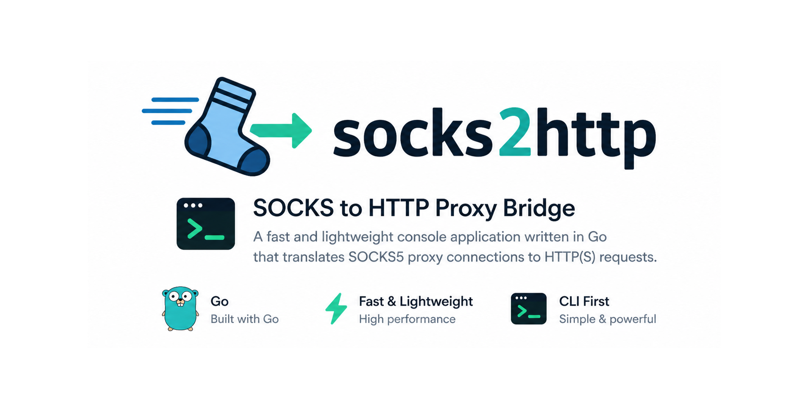

<p align="center">
  
</p>

# socks2http

Small HTTP proxy that tunnels client traffic through a SOCKS5 server. Use it when apps or tools only support an HTTP proxy but your network path is SOCKS5.

## Usage

You can run socks2http either with CLI flags or with a JSON config file.

### CLI flags

```bash
./socks2http -l 127.0.0.1:5566 -s 127.0.0.1:5555 -d
```

| Short | Long | Meaning |
|-------|------|---------|
| `-l` | `--listen` | HTTP proxy listen address (default `127.0.0.1:5566`) |
| `-s` | `--socks5` | Upstream SOCKS5 server, `host:port` (default `127.0.0.1:5555`) |
| `-u` | `--user` | SOCKS5 username (optional) |
| `-p` | `--password` | SOCKS5 password (optional) |
| `-d` | `--debug` | Log each request (method, target, status, duration) |
| `-c` | `--config` | Path to JSON config file (overrides the flags above) |
| `-v` | `--version` | Print version and exit |
| `-h` | `--help` | Show help |

### JSON config

```bash
cp config.example.json config.json
./socks2http -c config.json
```

`config.json` fields:

| Field | Meaning |
|--------|---------|
| `listen_addr` | Address where this HTTP proxy listens (e.g. `127.0.0.1:5566`) |
| `socks5_addr` | Upstream SOCKS5 server (host:port) |
| `username` / `password` | Optional SOCKS5 credentials (empty if not used) |
| `debug` | If `true`, logs each request (method, target, status, duration) |

Point your client’s HTTP proxy setting at `listen_addr`. HTTPS works the same way (the client uses `CONNECT` through this proxy).

Prebuilt binaries for common platforms are attached to **Releases** when you publish a version tag (`v*`, e.g. `v1.0.0`).

## License

MIT — see [LICENSE](LICENSE).
